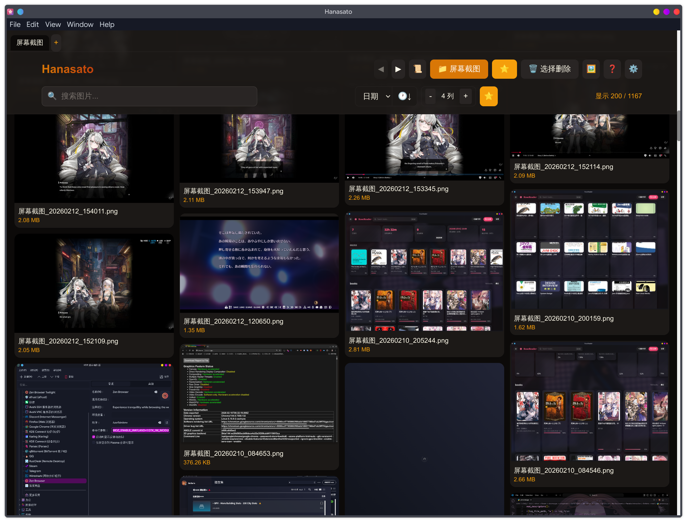
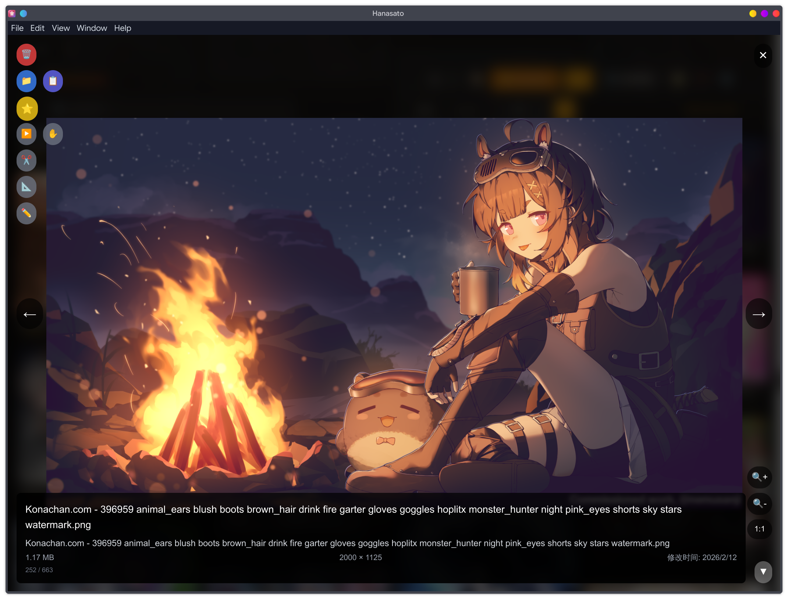
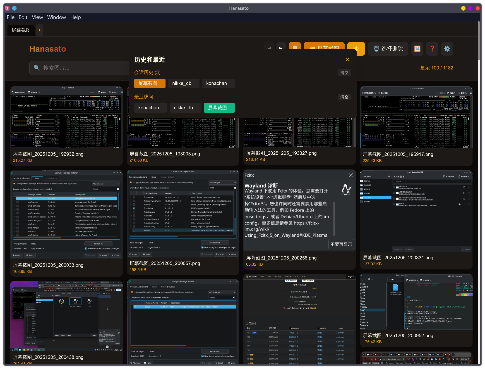
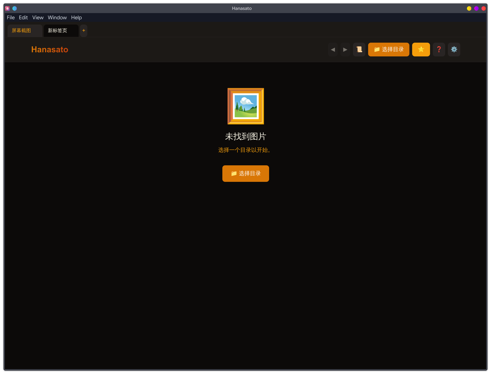
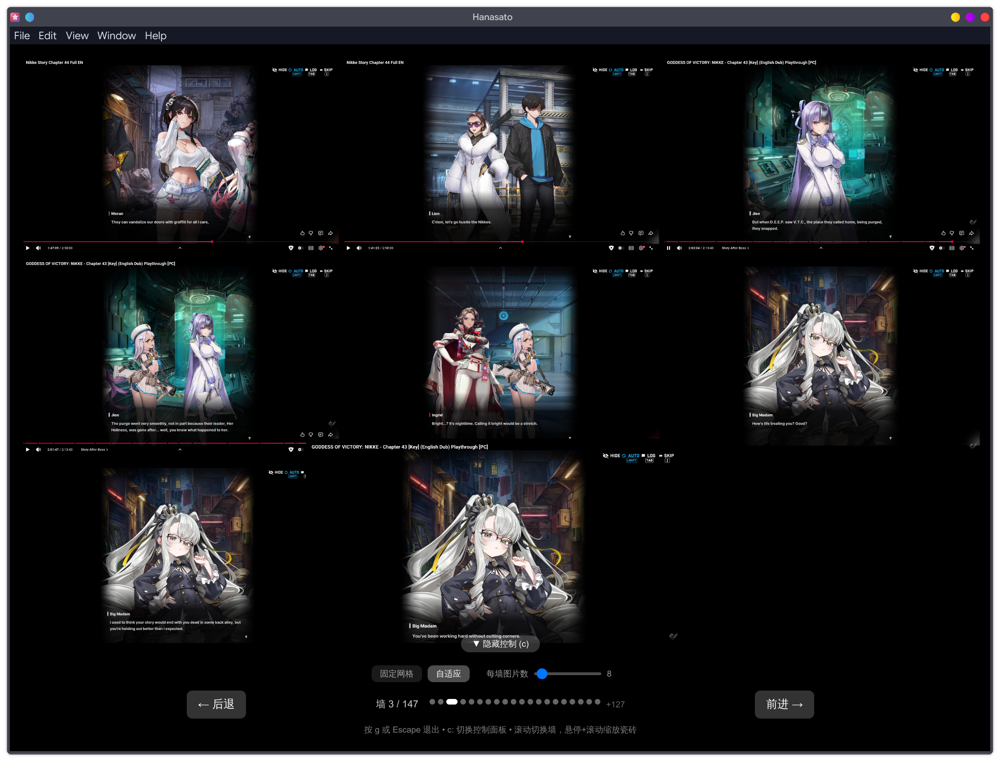
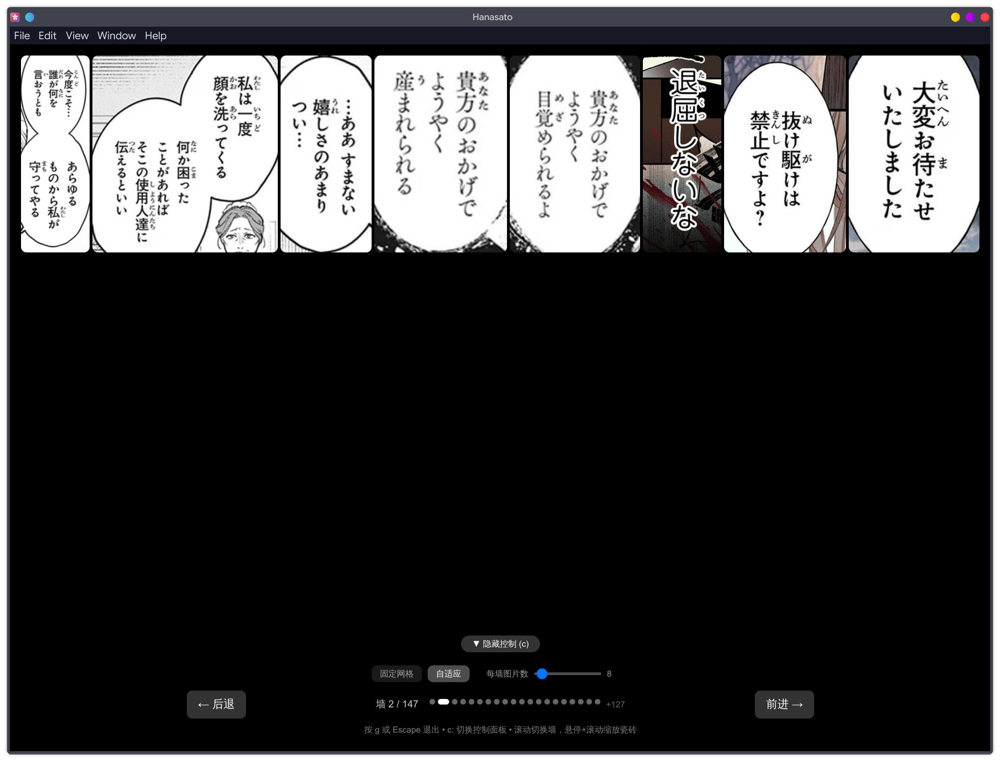

# Hanasato

[English](./README.md)

Hanasato 是一个基于 Electron 的本地优先桌面看图工具。

这个项目最初是一个 vibe coding 项目，随后持续迭代，目标是成为日常可用、加载快速的大图量图片工作流工具。

## 界面截图

### 瀑布流浏览




### 多标签与文件夹历史




### 全屏查看与图库操作




## 功能概览

### 图片库浏览
- 使用 `fast-glob` 递归扫描目录
- 支持 2-8 列可调瀑布流
- 面向大图库的无限滚动加载
- 按文件名/路径/目录搜索
- 按名称/时间/大小排序（升序或降序）

### 导航与整理
- 多标签页，标签独立状态
- 目录前进/后退历史
- 持久化最近访问目录
- 拖拽文件夹直接打开
- 收藏系统（图片目录下 `Starred Images`）
- 批量选择并移动到回收站

### 查看与编辑
- 全屏模态查看器
- 缩放（0.5x-5x）、拖拽平移、幻灯片播放
- 复制图片到剪贴板
- 在文件管理器中定位文件
- 裁剪与缩放（另存为新文件）
- 重命名采用“复制为新文件名”方式

### Mosaic 模式
- 专门用于快速检图的拼墙模式
- 支持按每墙图片数或瓦片尺寸调节
- 多种动画和循环导航

### 自定义与多语言
- 内置多套主题
- 快捷键可自定义
- 行为开关（确认弹窗、点击外部关闭、操作提示）
- 界面语言支持：`en`、`zh-CN`、`ja`

## 安装

### Windows（源码运行）

前置要求：
- Node.js 16+
- npm

步骤：

```bash
git clone https://github.com/CamelliaV/local-image-viewer.git
cd local-image-viewer
npm install
npm start
```

构建发行包：

```bash
npm run package
npm run make
```

### Linux（源码运行）

前置要求：
- Node.js 16+
- npm

步骤：

```bash
git clone https://github.com/CamelliaV/local-image-viewer.git
cd local-image-viewer
npm install
npm start
```

构建发行包：

```bash
npm run make:linux
npm run make:deb
npm run make:rpm
npm run make:zip
```

### Arch Linux

仓库内提供 `PKGBUILD`：

```bash
makepkg -si
```

## 默认快捷键

所有快捷键都可在设置中重定义。

### 主窗口

| 按键 | 操作 |
| --- | --- |
| `Ctrl/Cmd + O` | 打开目录 |
| `Ctrl/Cmd + T` | 新建标签页 |
| `Ctrl/Cmd + W` | 关闭标签页 |
| `F` | 查看收藏 |
| `Backspace` | 切换删除模式 |
| `H` | 切换历史面板 |
| `G` | 切换 Mosaic 模式 |
| `,` | 打开设置 |
| `?` | 打开帮助 |

### 图片查看器

| 按键 | 操作 |
| --- | --- |
| `ArrowLeft` / `ArrowRight` | 上一张 / 下一张 |
| `+` / `-` | 放大 / 缩小 |
| `0` | 重置缩放 |
| `D` | 切换拖拽模式 |
| `Space` | 切换幻灯片 |
| `Delete` | 删除图片 |
| `S` | 收藏 / 取消收藏 |
| `Y` | 复制到剪贴板 |
| `L` | 打开文件位置 |
| `X` | 切换裁剪模式 |
| `R` | 切换缩放模式 |
| `C` | 切换元信息抽屉 |
| `Escape` | 关闭查看器 |

## 技术栈

- Electron 25
- React 18（渲染层通过 CDN 运行）
- Tailwind CSS（CDN）
- fast-glob
- Electron Forge

## 项目结构

```text
.
├── main.js              # Electron 主进程（窗口、IPC、协议）
├── preload.js           # 通过 contextBridge 暴露安全 API
├── renderer/index.html  # React 单文件渲染层
├── locales/             # 多语言资源（en、zh-CN、ja）
├── assets/              # 图标与 desktop 文件
├── forge.config.js      # 打包与 fuses 配置
├── imgs/                # README 截图
├── README.md            # 英文 README
└── README.zh-CN.md      # 中文 README
```

## 安全说明

- 渲染进程禁用 `nodeIntegration`
- 启用 `contextIsolation` 并仅暴露有限 preload API
- 本地文件通过 `local-image://` 自定义协议提供
- 生产配置启用了更严格的 Electron fuses

## 支持图片格式

`jpg`、`jpeg`、`png`、`gif`、`bmp`、`webp`、`svg`、`tiff`、`tif`、`avif`、`heic`、`heif`、`ico`

## License

MIT
